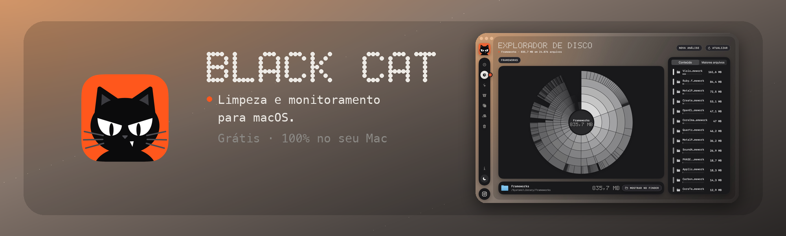
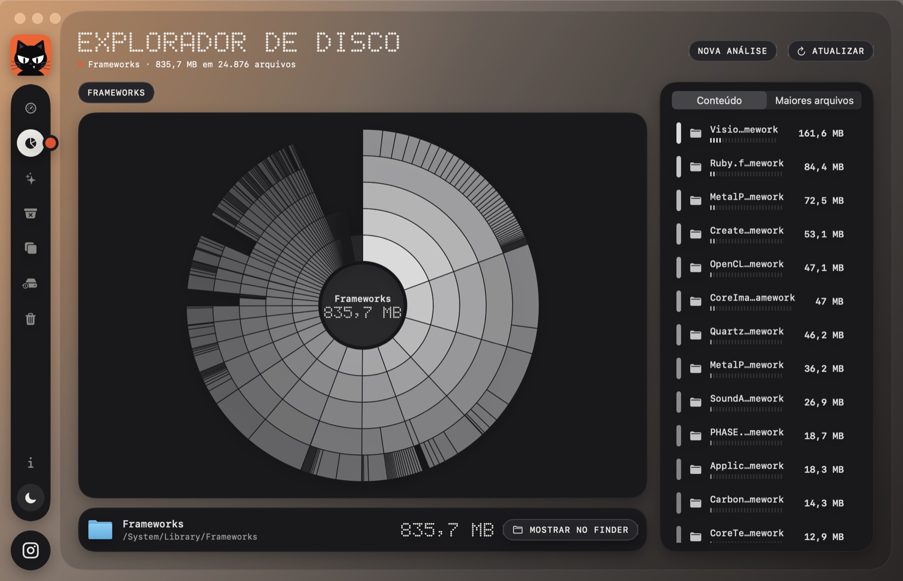
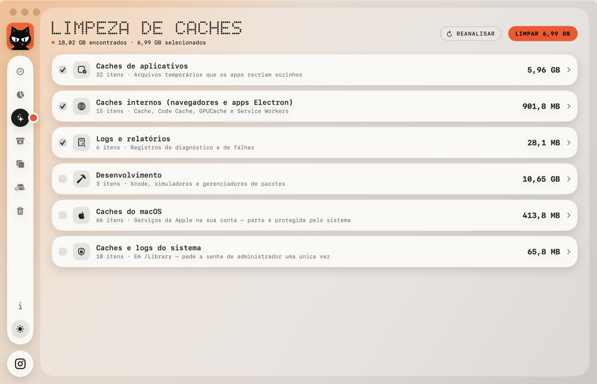
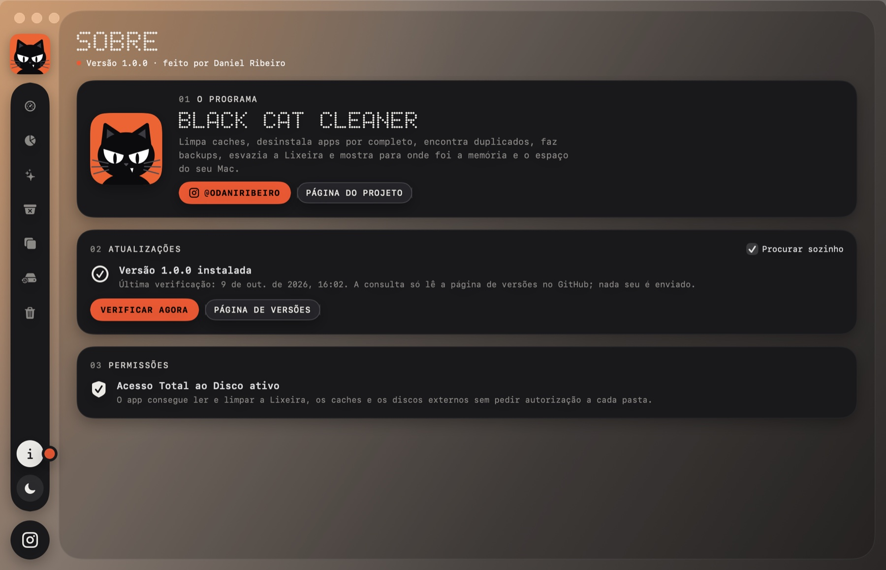

<p align="center">
  
</p>

<p align="center">
  <a href="https://github.com/odaniribeiro/black-cat-cleaner/releases/latest"></a>
  
  
  
  
</p>

<p align="center">
  <b>Limpeza e monitoramento para macOS, com cara de painel retrô.</b><br>
  Cartões pretos, números em matriz de pontos e um gato preto que pisca para você.<br>
  Veja para onde foi a memória e o espaço do seu Mac e limpe só o que você escolher.
</p>

<p align="center">
  <a href="https://github.com/odaniribeiro/black-cat-cleaner/releases/latest"><b>⬇ Baixar para Mac</b></a>
  &nbsp;·&nbsp; <a href="#como-instalar">Como instalar</a>
  &nbsp;·&nbsp; <a href="https://odaniribeiro.github.io/black-cat-cleaner/">Página do app</a>
  &nbsp;·&nbsp; <a href="https://odaniribeiro.github.io/black-cat-cleaner/#wallpapers">Wallpapers</a>
</p>

---

## Veja em ação

O mapa em anéis do seu disco: clique numa fatia para entrar na pasta e achar o que pesa.

<p align="center"></p>

<details>
<summary>Mais telas</summary>

<p align="center">
  
  
</p>

</details>

## O que ele faz

| | |
|---|---|
| **Panorama** | Memória, armazenamento, uso do processador e temperatura de CPU e GPU em tempo real. |
| **Explorador de Disco** | Mapa em anéis do disco: clique numa fatia para entrar na pasta, ache os arquivos pesados e mande para a Lixeira ou abra no Finder. |
| **Limpeza de Caches** | Caches de apps, navegadores, logs e sobras de desenvolvimento, com **você escolhendo o que sai**. |
| **Desinstalador** | Remove o app e tudo o que ele espalhou pelo sistema. |
| **Duplicados** | Encontra arquivos idênticos comparando o conteúdo. |
| **Backups** | Salva apps e suas configurações em vários destinos ao mesmo tempo. |
| **Lixeira** | Esvazia a Lixeira de todos os discos de uma vez. |
| **Barra de menus e widget** | Processador e temperaturas sempre à vista. |
| **Tema claro e escuro** | Alternador no trilho lateral. O gato pisca, olha para o mouse e ronrona se você clicar. |
| **Atualiza sozinho** | Avisa quando sai uma versão nova e gratuita, e atualiza com um clique. |

## Como instalar

1. Baixe o **`BlackCatCleaner-x.y.z.dmg`** na [página de versões](https://github.com/odaniribeiro/black-cat-cleaner/releases/latest).
2. Abra o arquivo e **arraste o Black Cat Cleaner para Aplicativos**.
3. Abra o app. **Na primeira vez**, o macOS pode avisar que não conhece o desenvolvedor. Clique com o **botão direito** no app › **Abrir** › **Abrir**. Só é preciso uma vez.
4. Para a limpeza funcionar sem pedir autorização a cada pasta, ative o **Acesso Total ao Disco** quando o app sugerir (tela **Sobre**). O app abre a tela certa e percebe quando você volta.

Se o macOS insistir em bloquear, rode no Terminal:

```bash
xattr -dr com.apple.quarantine "/Applications/Black Cat Cleaner.app"
```

## O que você precisa

- **Mac com chip Apple (M1 ou mais novo)** e **macOS 14 ou superior**.
- Mais nada: não há conta, cadastro nem instalação extra.

## Segurança e privacidade

- **Tudo acontece no seu Mac.** O app não coleta, não envia e não guarda nada seu em servidor algum. Não há conta, telemetria nem servidor.
- A **única conexão** que ele faz é **ler esta página de versões** para saber se há atualização (só uma leitura; nada seu é enviado). Dá para desligar em *Sobre › Procurar sozinho*.
- **Você decide o que sai.** A limpeza mostra o que encontrou, em categorias, e só mexe no que estiver marcado. Arquivos pesados do Explorador vão para a Lixeira.
- **Itens do sistema** (em `/Library`) pedem a senha de administrador, uma única vez, e ela fica com o macOS, nunca com o app.
- **Acesso Total ao Disco** serve só para ler a Lixeira, os caches e os discos externos sem perguntar a cada pasta. Você liga e desliga quando quiser, nos Ajustes do Sistema.
- **Antes de atualizar**, o app confere a integridade do arquivo baixado (SHA-256 publicado junto da versão). Nada acontece sem o seu clique.

## Atualizações

O Black Cat Cleaner avisa sozinho quando sai uma versão nova e **gratuita**, na tela **Sobre** e com uma bolinha no ícone. Com um clique em **Atualizar agora** ele baixa, confere a integridade, troca o app e reabre.

> Como as versões não têm a assinatura paga da Apple, depois de atualizar o macOS pode pedir de novo o Acesso Total ao Disco. A tela **Sobre** mostra o botão para ativar.

## Limites conhecidos

- **Só Macs com chip Apple.** Mac com processador Intel não é compatível.
- **Não está na Mac App Store** e não é assinado nem notarizado pela Apple, daí o passo de "botão direito › Abrir" na primeira vez.
- Apagar arquivos pode ser **irreversível** (a exceção é o que vai para a Lixeira). Revise a lista antes de limpar e mantenha um backup do que for importante.

## Problemas e sugestões

Encontrou algo estranho ou tem uma ideia? Abra uma **issue** aqui no GitHub descrevendo o que aconteceu.

## Créditos

Criado e desenvolvido por **Daniel Ribeiro** · Instagram [@odaniribeiro](https://www.instagram.com/odaniribeiro/).

## Termos e licenças

O Black Cat Cleaner é distribuído gratuitamente, **sem garantias**, e os direitos sobre ele são reservados ao autor. Veja os [termos de uso](TERMOS.md) e os [avisos de componentes de terceiros](TERCEIROS.md).
